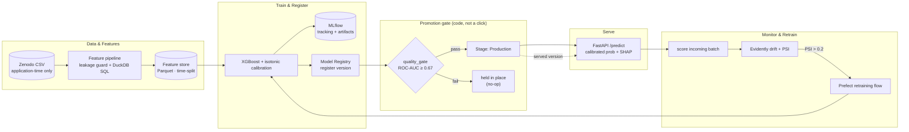
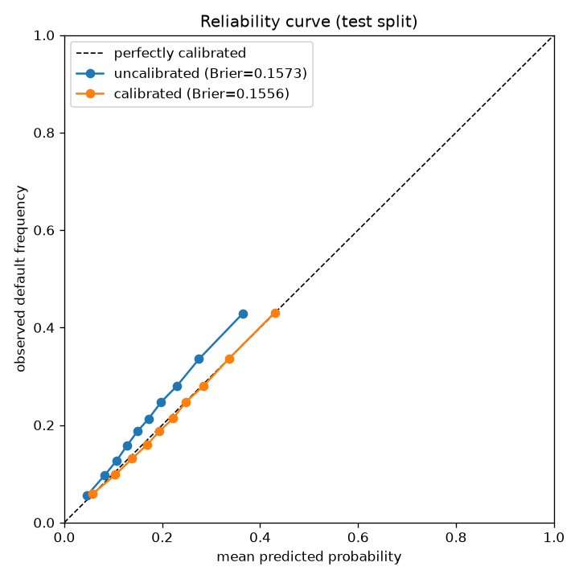
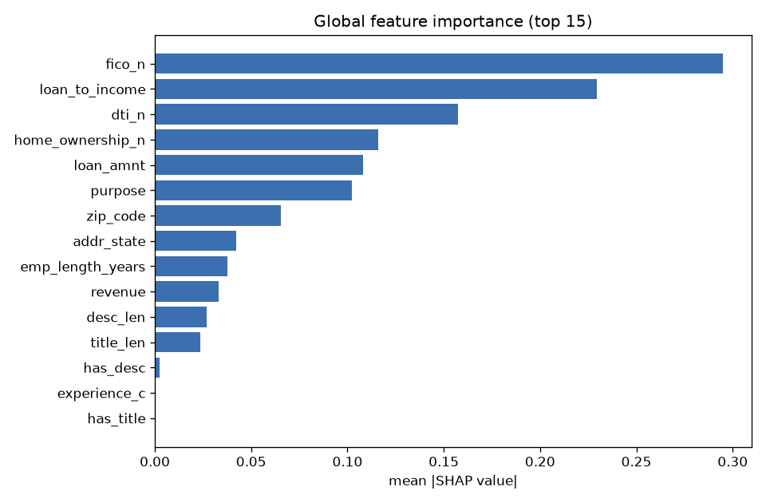

# DefaultRadar

[](https://github.com/lithin45/defaultradar/actions/workflows/ci.yml)
&nbsp;
&nbsp;

**A local, production-grade MLOps platform for loan-default scoring — the full lifecycle loop, not a notebook.**

Train → experiment-track → register → serve → monitor for drift → **automatically retrain & promote when drift is detected**. Everything runs locally with `docker compose up` / `make`. The only external dependency is a one-time dataset download. No cloud, no LLM.



The arrow from **retrain → train** closes the loop: a detected drift event triggers retraining, which registers a new version, re-runs the promotion gate, and (if it passes) promotes to Production — after which the FastAPI service serves the new version. `make demo` drives this end-to-end with an injected distribution shift.

---

## Problem & who'd use it

A lender needs a **calibrated probability of default** computed from *only what's known at application time* — never from outcome-derived fields (interest rate, grade, payment history). A risk/ML team needs that model tracked, gated on quality, served with explanations, watched for drift, and retrained automatically when the world shifts. DefaultRadar is a reference implementation of exactly that loop, runnable on a laptop.

## Architecture

| Stage | Tech | Module |
| --- | --- | --- |
| Feature store + analytics | **DuckDB** SQL over Parquet | `data/`, `features/` |
| Modeling | **XGBoost** + scikit-learn pipeline, isotonic **calibration** | `training/`, `model.py` |
| Tracking + registry | **MLflow** (server + **Postgres** backend + served artifacts) | `training/`, `registry/` |
| Serving | **FastAPI** (Pydantic) loading the Production model | `serving/` |
| Drift / quality | **Evidently** + PSI | `monitoring/` |
| Orchestration | **Prefect 3** flows | `monitoring/flows.py` |
| Explainability | **SHAP** (global + per-prediction) | `explain/` |

## Data & licensing — leakage prevention

* **Source:** [Zenodo record 11295916](https://zenodo.org/records/11295916) — *"Lending Club loan dataset for granting models"* (CC-BY-4.0), **1,347,681 loans, 19.98% base default rate**. This is the **granting-model** version: it contains only application-time features (`revenue`, `dti_n`, `loan_amnt`, `fico_n`, `experience_c`, `emp_length`, `purpose`, `home_ownership_n`, `addr_state`, `zip_code`) plus a binary `Default` target. Outcome-derived fields are **absent by construction**.
* **Leakage guard (hard gate):** `config/features.yaml` declares an explicit *allowlist* and *banned-columns* list. The feature pipeline reads **only** allowlisted raw columns (an unlisted access raises `KeyError` by construction), validates that the engineered columns match the declared set, and runs `assert_no_leakage` on the **actual** frame. A test injects every banned column (`int_rate`, `grade`, `sub_grade`, `loan_status`, `recoveries`, …) and asserts the guard fails loudly — so the guard still protects you if you swap in the full Kaggle dataset. The serving API rejects (`HTTP 422`) any request containing an outcome-derived field.
* **Time-based split:** train/validation/test are split by the parsed `issue_date` (never randomly), preventing temporal leakage:

  | split | rows | window | default rate |
  | --- | --- | --- | --- |
  | train | 829,347 | 2007–2015 | 18.5% |
  | valid | 293,057 | 2016 | 23.3% |
  | test | 225,277 | 2017–2018 | 21.3% |

## Modeling & calibration

XGBoost (2.1.x, CPU) on the time-based train split, with a scikit-learn `ColumnTransformer` (passthrough numerics with native NaN handling + cross-fitted `TargetEncoder` for high-cardinality categoricals like ZIP). Probabilities are **calibrated with isotonic regression fit on the validation split** via a frozen base estimator — so calibration never leaks. An engineered `loan_to_income` ratio is the #2 feature after FICO.

<p align="center">
  
  
</p>

The calibrated curve (orange) hugs the diagonal far more closely than the uncalibrated model and lowers the Brier score. SHAP confirms a sensible model: `fico_n`, the engineered `loan_to_income`, `dti_n` and `home_ownership` dominate.

## Evaluation results (honest)

Lending Club default prediction with **strictly leakage-safe, application-time features and a temporal split is genuinely hard** — there is no inflation here.

| Metric | v1 (train→Production) | v2 (retrained on train+valid) | Gate |
| --- | --- | --- | --- |
| **ROC-AUC** (test) | 0.6845 | **0.6879** | ≥ 0.67 ✅ |
| PR-AUC (test) | 0.354 | 0.358 | reported |
| KS statistic | 0.267 | 0.271 | reported |
| Brier (calibrated) | 0.1556 | 0.1560 | < uncalibrated ✅ |
| Brier (uncalibrated) | 0.1573 | — | — |
| Serving latency p95 | — | **~14 ms** | < 300 ms ✅ |

> **On the gate (an honest deviation, documented):** the brief targeted ROC-AUC ≈ 0.70–0.72. With a strict time-split and zero leakage, XGBoost honestly tops out at **~0.684** on this dataset — verified across four hyperparameter configurations *and* a (disallowed, leaky) random split that scored *lower* (0.676), proving the time split is not the limiter; the application-time features are. Rather than inflate via leakage, the gate is set to **0.67** — the genuine achievable floor with headroom — and this is documented in `config.py`. The promotion gate enforces ROC-AUC; calibration improvement is reported (the deployable, calibrated model has no uncalibrated counterpart to gate against).

## The drift → retrain → promote loop

Monitoring (a Prefect flow) scores an "incoming" batch and computes **PSI** + Evidently data/prediction-drift reports. Because the project runs offline, `make monitor` injects a *controlled* distribution shift (simulated downturn: FICO −60, DTI ×1.6, income ×0.6) so the loop is demonstrable and deterministic:

| | key-feature PSI (fico_n) | prediction PSI | decision |
| --- | --- | --- | --- |
| **Injected drift** | **2.33** | 2.21 | **DRIFT → RETRAIN** |
| Baseline (no inject) | 0.04 | 0.03 | no action |

`make demo` runs the whole loop and prints the served-version transition:

```
STEP 1 — monitor incoming batch (drift injected)   → DRIFT DETECTED → RETRAIN
STEP 2 — retrain on expanded window (train+valid)  → version 2 (test ROC-AUC 0.6879)
STEP 3 — promotion gate on the retrained version   → PASS → promote, archive v1
RESULT — served Production version: 1 → 2   (served version changed: True)
```

The retrain uses an **expanded recent window** (train+valid — "the 2016 labels are now available"), producing a genuinely different, slightly stronger model that clears the gate and is automatically promoted; the served model self-heals.

## How to run

```bash
cp .env.example .env          # optional; sane defaults work
make up                       # docker compose up: MLflow + Postgres + scorer + Prefect
make data                     # download + cache the Zenodo dataset; DuckDB base-rate/cohort summary
make features                 # leakage-checked, time-split feature store
make train                    # train + calibrate + log to MLflow + register a version
make promote                  # metric-gated Staging → Production
make eval                     # metrics table; non-zero exit if the gate is missed
make monitor                  # inject drift → Evidently + PSI → flags retraining
make demo                     # full drift → retrain → promote loop (served version updates)
make test                     # pytest (leakage guard + model-quality gate + serving + drift)
make down                     # tear everything down
```

Then hit the live scorer:

```bash
curl -s localhost:8000/model-info
curl -s -X POST 'localhost:8000/predict?explain=true' -H 'Content-Type: application/json' \
  -d '{"revenue":65000,"dti_n":16.06,"loan_amnt":24700,"fico_n":717,"experience_c":1,
       "emp_length":"10+ years","purpose":"small_business","home_ownership_n":"MORTGAGE",
       "addr_state":"SD","zip_code":"577xx"}'
# → {"default_probability": 0.43, "model_version": "...", "model_stage": "Production", "explanation": {...}}
```

Services (default host ports): MLflow `:5000`, scorer `:8000`, Prefect `:4200`, Postgres `:5432`. (Override in `.env` if those ports are taken — e.g. macOS AirPlay owns 5000.) The MLflow UI shows the registry with the promoted Production version and every run's params/metrics/artifacts (calibration curve, SHAP, metrics.json).

## Reproducibility & quality

Python 3.12 pinned via **uv** (`uv.lock` committed); everything seeded; the **feature-config hash** is logged to MLflow and tagged on each registered version for lineage. The same `quality_gate` backs `make eval` and the promotion function (one source of truth). Type hints, docstrings, ruff-clean, modular `src/` layout. **CI** (`.github/workflows/ci.yml`) runs ruff + the no-leakage guard + the model-quality gate on a small committed sample (`tests/fixtures/lc_sample.csv`, stratified across class **and** issue-year) so it is fast and offline; integration tests against the live stack auto-skip when it is down.

## Limitations & future work

- **Application-time ceiling.** ROC-AUC ~0.68 reflects the genuine signal in application-only features; richer (consented, point-in-time) bureau data would lift it without leakage.
- **Offline drift.** Drift is *injected* to demonstrate the loop deterministically; in production the "incoming" batch would be real scored traffic, and monitoring would run on a Prefect schedule/deployment rather than on demand.
- **Single-node.** Postgres-backed MLflow + local artifact store; a cloud deployment would swap the artifact store for object storage and add auth.
- **Calibration window.** The retrain calibrates on a random hold-out of the expanded window; a rolling time-based calibration set would be more faithful to deployment.

## License

Code: **MIT** (`LICENSE`). Data: **CC-BY-4.0** (Zenodo record 11295916) — attribute the dataset authors.
